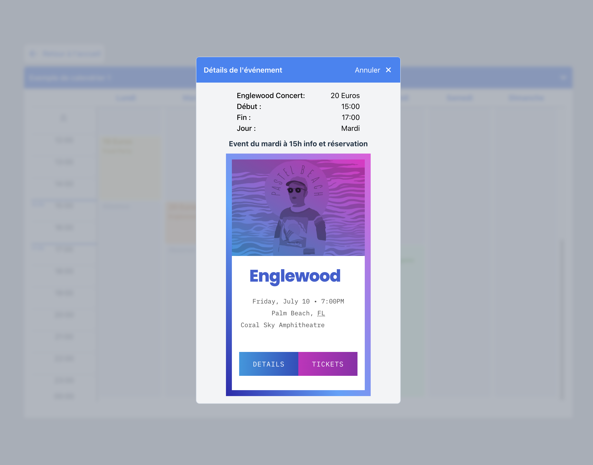
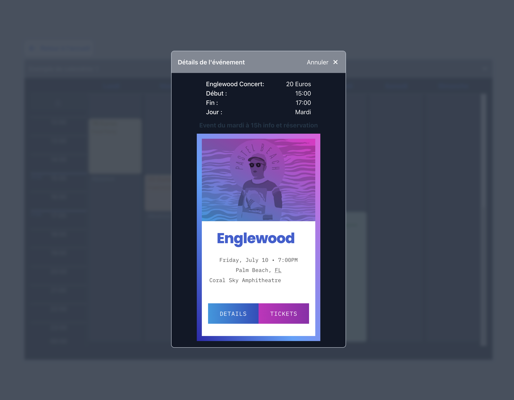

 

# React-simple-schedule-viewer

## complex example repository

## Component with event type

### light mode

### event details

- you can add custom element in the modal...
- 
- 

### dark mode

### event details

- you can add custom element in the modal...
- 
- 

## Component with calendar type

### light mode

### calendar details

- 

### dark mode

### event details

- 

# Live demo

- [Link to live demo](https://steady-hamster-02673e.netlify.app/)

# Link to the npm registry package:
- [Link ro npm](https://www.npmjs.com/package/react-simple-schedule-viewer)

# Simple examples folder

[For more simple examples you can click here](/Simple-examples/)